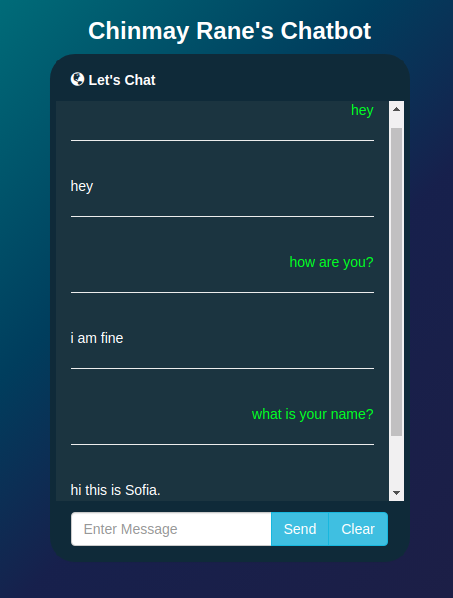

# Depression-Chatbot
In today's world, depression can hit anyone real hard. Depression is an extremely complex disease. No one knows exactly what causes it. The possible reasons could be loneliness, relationships, deadlines, genetics, abuse, conflicts, medications, major illnesses etc.  Some people may experience depression and feel overwhelmed with sadness and loneliness for no known reason. People dealing with depression want to tell their stories to somebody and they are mostly afraid to speak to their close friends and relatives. Depression-Chatbot is an attempt to cure depression among the people by gradually understanding the root cause.
It is developed from scratch with the intention of helping people in regulating their moods and eliminating distorted and negative thinking.

# Implementation
A basic Sequence to Sequence architecture is used for building conversational chatbot using Tensorflow framework. 
Scrapped the title of subreddits and its comments in a nested way so as to preserve sequence of "coversations" among the people on reddit. Some of the subreddits that were scraped includes r/depression_help, r/askatherapist, r/Stress, r/relationships, r/talktherapy etc.

# Requirements
* [python](https://www.python.org/downloads/) = 3.6
* [pandas](https://pandas.pydata.org/) = 0.22.0
* [numpy](https://www.numpy.org/) = 1.14.3
* [tensorflow](https://www.tensorflow.org/) = 1.13
* [flask](https://flask.palletsprojects.com/en/1.1.x/installation/)

# User Interface

